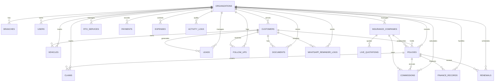

# BALAJI POLICY MATRIX LLP

## Enterprise Insurance, Finance & RTO ERP Database Design

This package provides a production-ready PostgreSQL schema for Supabase deployment with:
- 3NF normalization
- multi-organization and multi-branch support
- soft delete and audit trails
- row-level security foundations
- partitioning for large activity and WhatsApp logging tables
- search indexes and materialized views

## ER Diagram

## Relationship Strategy

- Every transactional table includes organization_id and branch_id for multi-tenant support.
- Customer, vehicle, policy, claim, finance and lead records are linked through UUID foreign keys.
- Soft delete is supported via is_deleted, deleted_at and deleted_by.
- Created/updated audit fields are present across all modules.

## Index Strategy

- B-tree indexes on tenant and lookup columns.
- GIN indexes for search vectors and fuzzy text search.
- Trigram indexes for name and registration number search.
- Partitioned tables for high-volume logs.

## Search Optimization

- TSVECTOR search_vector columns are included for customer, vehicle, policy, lead and claim records.
- Full-text search examples are included in the SQL file.

## Security & Governance

- Row-level security is enabled for all tenant tables.
- Policies assume authenticated Supabase users and organization membership.
- Passwords are stored as hashes using pgcrypto-friendly patterns.

## Performance Notes

- Materialized views are included for dashboard reporting.
- Partitioning is used for activity logs and WhatsApp logs for large-volume systems.
- The schema is suitable for high-volume quote and renewal workloads.

## Recommended Next Step

Import the SQL file into Supabase SQL Editor and run it in order.
